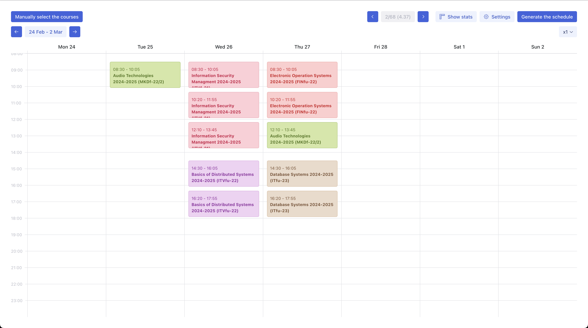
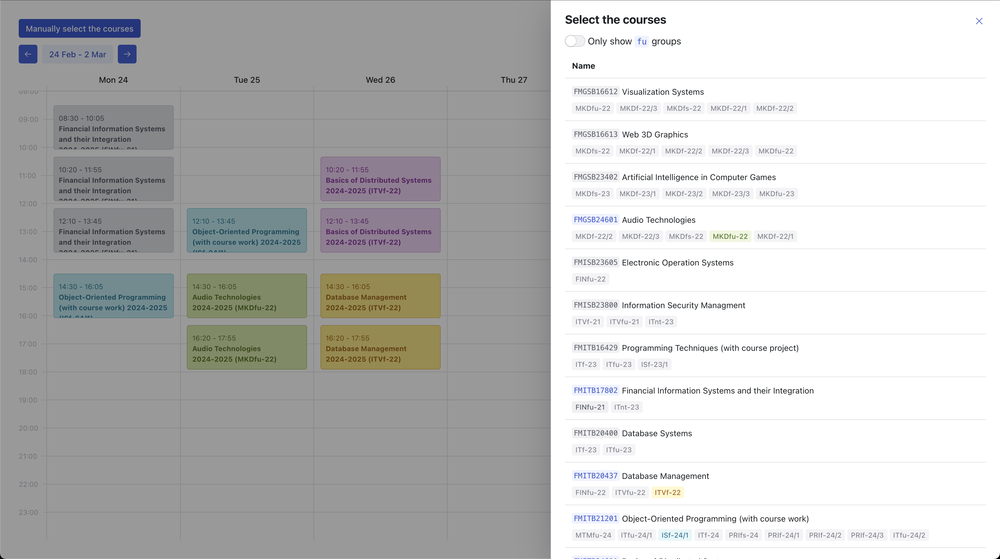
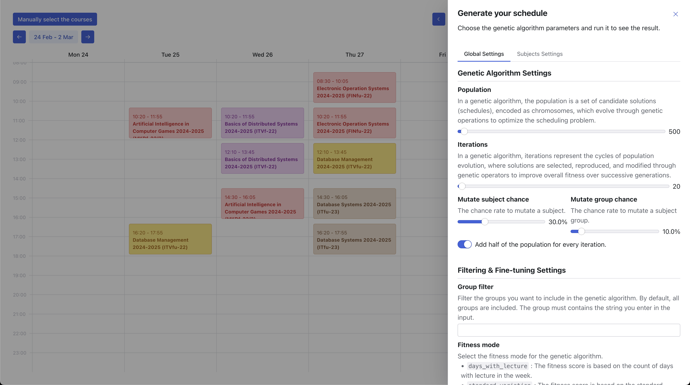

# Vilnius Tech Schedule

This repository is a set of tools whose main purpose is to optimize the courses schedule at Vilnius Tech University.

## Installation

1. Run the scraper in the `scraper` directory by following the instructions in the `scraper/README.md` file. The scraper is responsible for fetching the schedule data from the Vilnius Tech mano system and storing it in a JSON file.
2. Launch the UI in the `ui` directory by following the instructions in the `ui/README.md` file. From the UI, you'll be able to view the schedule data and optimize your courses schedule by tweaking a genetic algorithm.

> Note that if you want to optimize different study programs, you will have to modify the `src/constants/study-programs.ts` file in the `scraper` directory and run the scraper again to fetch the new data. Then re-optimize a schedule. You cannot optimize different study programs from the UI.

> When clicking the `Generate the schedule` button in the UI, it can take some time since the genetic algorithm is not optimized for speed and everything is run in the browser.

## Screenshots

